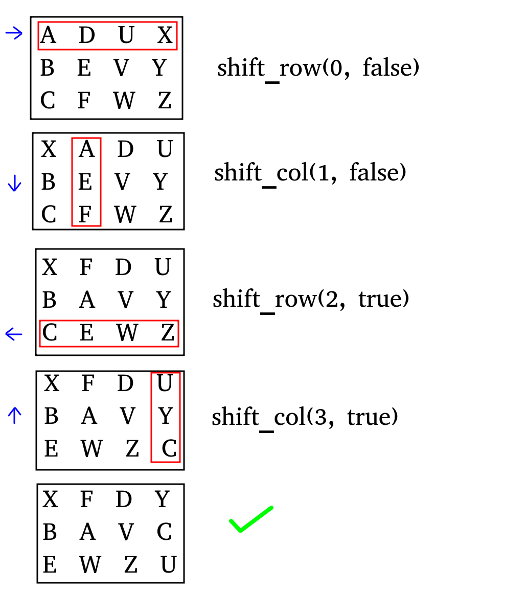

# Dynamically Allocated Two-Dimensional Arrays

--- 
## GAI Usage Policy

* For this assignment, spend at least 90 minutes working **without the assistance of GAI.**
* After 90 minutes have passed, **create a commit** for your progress with the message "initial independent progress"
* Afterwards you may, if you wish, use whatever GAI tools are at your disposal to complete the assignment

---

## Assignment Description:


You are the world-renowned archeologist Jonathan Jones, out on yet another expedition filled with danger and mystery. You’ve finally arrived at the resting place of the ancient stone mask, but a series of puzzles blocks your path!

Each puzzle consists of a grid of symbols. Each row and each column of the puzzle can be rotated in either direction. When rotated, the furthest symbol wraps around to the opposite end of the grid, and the rest of the symbols each shift one position.



Since Jonathan Jones always comes prepared, you already know the solutions to these puzzles and have made a list of moves needed to get through each one.

## Special Requirements:

* You MUST be passing the `create_grid` unit test first, or else the other tests may not be accurate
* You must be passing all unit tests before working on the stdio test

* You are not allowed to use the `new` or `delete` operators in the `shift_row` function
* You are not allowed to use the `new` or `delete` operators in the `shift_col` function

## Input:

The input to your program is structured as follows:
```
< # of puzzles >
(for each puzzle:)
< # of rows > < # of columns > < # of moves >
[<char> <char> ... 
 <char> <char>
 ...              ] (symbols in puzzle)
(for each move:)
< row/column> < direction > (R - right, L - left, D - down, U - up)
```

### Sample input/output:

**INPUT:**
```
2
3 4 4
A D U X
B E V Y
C F W Z
0 R
1 D
2 L
3 U
2 2 1
@ #
$ %
1 R
```
**OUTPUT:**
```
X F D Y
B A V C
E W Z U

@ #
% $

```

For each puzzle you are to:
* Dynamically allocate a 2-D char array of the specified size
* Fill your puzzle with symbols from standard input
* Perform the necessary shifts to solve the puzzle, and output the result
* De-allocate your 2-D array to be used for the next puzzle

## Scoring:

To get full points on the assignment...
* Implement each function in the _Puzzle_ class **(unit_tests)**
* Complete the _main()_ function to solve all puzzles **(stdio_tests)**
* Fix any memory leaks or invalid memory operations **(mem_tests)**
* Address any warnings given by cppcheck **(static analysis)**
* Format your code using the clang-format utility **(style check)**


