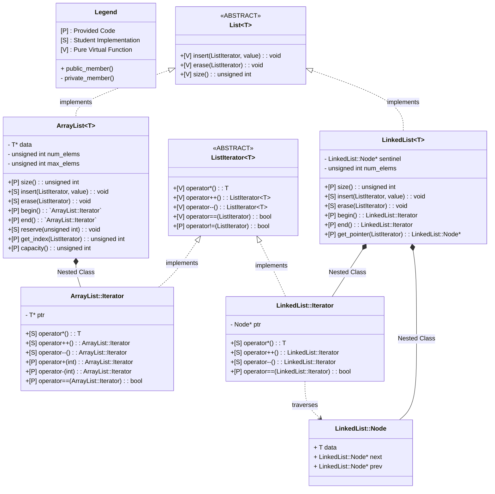

# Implementation and Analysis of Lists

In this project, you'll be creating and analyzing two implementations of a _List (abstract interface)_, along with their corresponding implementations of a _ListIterator (abstract interface)_.
The figure below illustrates the class definitions and relationships involved.

---
## GAI Usage Policy

* You **MAY** utilize GAI tools to assist you with developing and debugging your code for this project (the _Implementation_ portion).
    * You may use any GAI tools you wish, as long as you document them completely.
* You **MAY NOT** use GAI to interpret the results of your benchmarks or to generate the report submitted to Canvas (the _Analysis_ portion).
    * If the results of your benchmarks do not match your expectations, then you may use GAI to help with improving your implementations.
* You **MUST** document your GAI usage and submit it with your report
    * Copy-paste or export the **entire** prompt-response session(s) and save this information in a document which will be submitted to Canvas
    * If you choose not to utilize GAI at all, then simply state that in your document, but it is expected that you will use GAI for the implmentation portion.

---
## Implementation: ArrayList and LinkedList

This section of the project is **automatically graded** and submitted to ****

Complete the following for the _Implementation_ portion:
1. Edit `src/list_implementations/array_list.ipp` to build the `ArrayList` class and its iterator
    * You **MAY NOT** edit the header file, `src/include/array_list.hpp`
    * This implementation should use a single, contiguous storage array for its data.
    * Verify your code using the tests labeled `unit_al` and `memory_al` as you go.
    * Use command: `make analysis_array_list` from within the `src/` directory to see if you've created an efficient implementation. An **RMS Error** of 15% or less generally means your list fits the target time complexity. 
2. Edit `src/list_implementations/linked_list.ipp` to build the `LinkedList` class and its iterator
    * You **MAY NOT** edit the header file, `src/include/linked_list.hpp`
    * This implementation should be for a doubly-linked, circular list with a sentinel node as discussed in the lectures.
    * Verify your code using the tests labeled `unit_ll` and `memory_ll` as you go.
    * Use command: `make analysis_linked_list` from within the `src/` directory to see if you've created an efficient implementation. An **RMS Error** of 15% or less generally means your list fits the target time complexity.
3. Edit `src/benchmarks/benchmark_functions.hpp` to create functions `linear_search` and `selection_sort` acting on generic `ListIterator` arguments.
    * Verify your code using the tests labeled `unit_bm` as you go.
    * These functions will be used to compare your lists in the analysis portion of the project.
4. Complete the `static_analysis` and `format` tests, and submit your code before the deadline.

---
## Analysis: Performance Comparison

This section of the project is **manually graded** and submitted to **Canvas**

Complete the following for the _Analysis_ portion:
1. Create a report (using LaTeX, LibreOffice, or Microsoft Word) including your name and section for the following steps.
2. For each of `src/benchmarks/random_access_benchmark.cpp`, `src/benchmarks/insertion_benchmark.cpp`, `src/benchmarks/linear_search_benchmark.cpp`, and `src/benchmarks/selection_sort_benchmark.cpp`, do the following:
    * Analyze, but do not edit, the benchmark code.
        * This code uses the "Google Benchmark" library, the same as the in-class activity on profilers. Only the code in the scope of `for (auto : state)` is timed.
    * Create and write down a _runtime function_ for the `ArrayList` and `LinkedList` versions
        * List which operations/methods you are considering as _elementary operations_.
        * Give the _time complexity_ using Big-O notation.
    * Perform the _empirical_ test by using the command: `make run_bench_random_access`, `make run_bench_insertion`, `make run_bench_linear_search`, or `make run_bench_selection_sort` from within the `src/` directory
    * Copy-paste the results into your report and interpret them.
        * The benchmark code performs a "regression analysis" to guess the time complexity from data points collected by testing with increasingly large lists. 
        * Say how the results support or reject your analysis of the time complexity.
3. Generate a **PDF** of your report, create a zip file including this and your GAI usage documentation, and submit to Canvas before the deadline. Your zip file should include:
    * A PDF report containing your analysis.
    * A document (text or PDF) documenting your usage of GAI.
    
